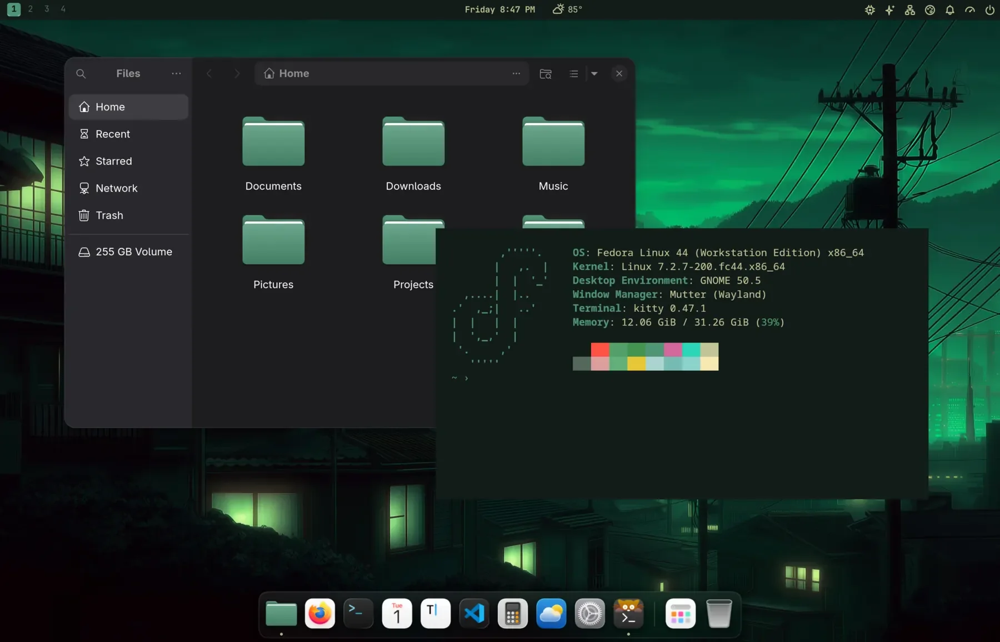
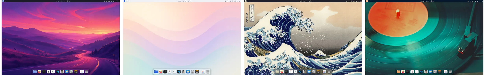

# Jade Shell

**Omarchy's look and polish, on the GNOME you already run.**



Jade Shell gives GNOME 22 of Omarchy's themes, a dock that feels like the Mac's and a redrawn top bar. Pick a theme and everything follows: the Shell, your GNOME apps, your terminal, VS Code, Neovim, even Claude Code. Change your mind and one command puts your desktop back exactly as it was.

**Try the dock in your browser: [jadeshell.app](https://jadeshell.app)**

## Install

```bash
wget -qO- https://jadeshell.app/install | bash
```

Open the Terminal app, paste this line and press Enter. It asks for your password once, takes a minute or two, and offers to log you out at the end; a welcome window then walks you through the rest. (`curl -fsSL https://jadeshell.app/install | bash` works too.)

It needs GNOME 50: Fedora 44 or Ubuntu 26.04. On anything else (older GNOME, Fedora Atomic desktops) the installer tells you so and changes nothing. The script is [`install.sh`](install.sh) in this repository, if you'd like to read it first. Jade Shell is a beta (0.9).

## What you get

- **22 themes**, dark and light. One click re-colors the Shell, GNOME apps, Ptyxis, Kitty, Ghostty, Alacritty, VS Code, Neovim, tmux, btop, Obsidian and more.
- **The dock:** icons grow under your pointer, apps bounce while they launch, windows pour into their icon when you minimize them. All on frosted glass.
- **A redrawn top bar:** numbered workspaces, the weather by the clock, a system monitor and your Claude and Codex usage.
- **The Jade Menu** (Super+Alt+Space): apps, screenshots, toggles and settings, all from the keyboard.
- **The small things:** clipboard history, a screenshot card, a color picker, Wi-Fi as a QR code, and Omarchy's keymap if you want it.



## Undo anything

```bash
jade theme undo    # the last theme switch
jade restore       # your desktop from before Jade Shell
```

## Remove

```bash
wget -qO- https://jadeshell.app/install | bash -s -- --uninstall
```

It asks first, puts your desktop back, then removes Jade Shell.

## More

- **[The guide](docs/guide.md):** every feature, what a theme switch changes, updates, overrides and hooks.
- **Found a bug?** Run `jade debug`. It gathers what a report needs and opens a pre-filled issue.
- **Working on the code?** See [CONTRIBUTING.md](CONTRIBUTING.md).

## Credits

Jade Shell stands on other people's work: [Omarchy](https://github.com/basecamp/omarchy)'s themes, templates and usage collectors (MIT), GNOME Shell's theme sources (GPL-2.0-or-later), the layout of [Omarchy Notification Center](https://github.com/jankeesvw/omarchy-notification-center) (an idea, no code), and ideas and code from [Simple Workspaces Bar](https://gitlab.com/null-git/simple-workspaces-bar), [Panel Date Format](https://github.com/KEIII/gnome-shell-panel-date-format), Just Perfection, App Grid Tuner, TopHat and Vitals. The Mac-style icons are [MacTahoe](https://github.com/vinceliuice/MacTahoe-icon-theme). Details in [THIRD_PARTY_LICENSES.md](THIRD_PARTY_LICENSES.md).

GPL-3.0-or-later. Not affiliated with Omarchy, Basecamp, GNOME or Apple.
