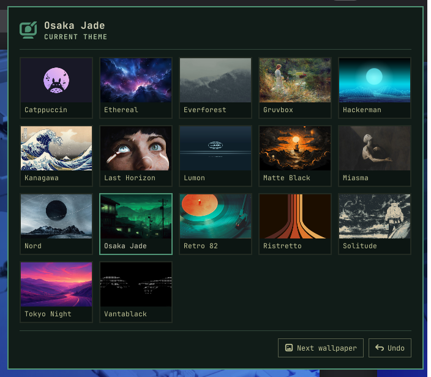

# Jade Shell

**Omarchy's look for the GNOME you already have.**

One install gives Fedora or Ubuntu Omarchy's 22 themes, dark and light, a theme picker that re-colors the whole desktop at once, workspace buttons, a light system monitor and your Claude and Codex usage in the top bar. No new OS, no tiling window manager to learn.

**Status: early (0.9), GNOME 50 only.** Tested on Fedora 44 and Ubuntu 26.04. Fedora Atomic desktops (Silverblue, Kinoite) are not supported yet: the installer stops on them.



## Install

```bash
curl -fsSL https://raw.githubusercontent.com/parvezrob/jade-shell/main/install.sh | bash
```

Run it as your desktop user. It downloads the latest `.rpm` or `.deb` release, checks it against the release checksums, installs it with `dnf` or `apt` (asking for your password), then runs `jade setup`, which:

- turns off extensions that do the same jobs or would take over the top bar (Dash to Panel, OpenBar, User Themes, Blur my Shell, system monitors such as Vitals and a few more; `setup` names each one it turns off, and `jade restore` turns them back on),
- sets up the dock (Dash to Dock on Fedora, Ubuntu Dock on Ubuntu),
- starts the usage collector if you have Claude Code or Codex,
- downloads the first wallpaper of each theme for the picker's previews (one full-size image per theme; other wallpapers are downloaded when you pick them),
- applies Osaka Jade.

Running `jade setup` again keeps the dock layout and AI usage choice you made since; with AI usage turned off, the collector stays stopped.

**Updates** come through `dnf`, `apt`, GNOME Software or the installer. Jade Shell notices a new version is installed and offers to log out; at the next login it finishes the update in the background (the settings and one-time changes the new version needs, the theme rebuilt), leaves on any extension you turned back on yourself, and says when it's done. `update.log` in `~/.local/state/jade-shell` has the details.

Once a day Jade Shell also asks the latest release for its version (a few bytes from GitHub; turn it off under **Updates** in the settings). When a newer one is out, a notification offers **Update**, which asks for your password in GNOME's own dialog and installs it, and **What's new**. From a terminal, `jade update` does the same (`jade update --check` only looks). The package is checked against the release's `SHA256SUMS` before anything is installed.

If your home folder still has a copy of Jade Shell from before the packages (or from `scripts/dev-install.sh`), GNOME Shell would keep loading it instead of the package's, so the installer stops and prints the `rm -rf` command that removes it; run that, then the installer again. `jade setup` and `jade doctor` also point out such copies, and files left by older versions (Jade AI Usage, `jade-theme`), with the command to remove them. Nothing is deleted for you.

Log out and back in once to start the extension. A few notes at that first login show where the picker, the bell and AI usage are (once each). `jade doctor` checks everything is in place.

## Use

- **Picker:** click the palette icon in the top bar, or press **Super+Ctrl+Shift+Space**. Arrow keys move, Enter applies. The menu stays open while you try themes. Each theme keeps the wallpaper you last gave it; pick the current theme again for its next wallpaper.
- **Command line:**

  ```bash
  jade theme list                 # themes; * marks the current one
  jade theme plan tokyo-night     # show exactly what would change, change nothing
  jade theme set tokyo-night      # switch
  jade theme wallpaper            # next wallpaper of the current theme
  jade theme undo                 # restore what the last switch changed
  ```

  `--only` and `--skip` limit a switch to some targets, e.g. `jade theme set nord --skip vscode,kitty`. The target names are in the table below.
- **Leave an app alone:** turn it off under **Apps** in the settings, or run `jade apps off kitty`. Its own config comes back as it was before Jade Shell (keeping any edits you made since), and no switch, setup or picker touches it again until `jade apps on kitty`. `jade apps` lists them all.
- **Reporting a problem:** `jade debug` collects what a bug report needs (versions, GPU, extensions, `jade doctor`, the end of the install log, GNOME Shell's messages about Jade Shell) with your user name, host name and home folder replaced, and offers to save it and open a pre-filled GitHub issue. The settings' About page has the same as **Report a Problem…**.
- **Settings:** open Jade Shell's settings (Extensions app, or Settings in the AI usage menu). **Desktop** turns parts of the top bar on or off, sets the clock format, the app grid size and the picker's shortcut, and chooses which apps get themed. **AI Usage** sets how often usage is collected. **About** has the version and credits, the update check, **Run Checks** (what `jade doctor` checks, with what to do about each problem) and **Restore My Previous Desktop**: everything `jade doctor` and `jade restore` do, without a terminal.

## What a theme switch changes

| Target (name) | How |
|---|---|
| GNOME Shell (`shell`) | a Shell theme compiled from GNOME's own theme sources (the light ones for light themes) with the Omarchy palette and the theme's exact accent: top bar, menus, quick settings, calendar, notifications, dialogs, lock screen |
| GNOME (`gnome`) | light or dark style to match the theme, the nearest named accent for apps, wallpaper (desktop and lock screen) |
| Dock (`dock`) | Dash to Dock or Ubuntu Dock colors |
| Ptyxis (`ptyxis`) | an Omarchy palette file, selected in every profile |
| GNOME apps (`gtk`) | the theme's colors in a marked block of `~/.config/gtk-4.0/gtk.css` and `gtk-3.0/gtk.css` (libadwaita's named colors and CSS variables), so Files, Settings, Text Editor and other GNOME apps follow the theme when they next start; GTK 3 apps follow with the adw-gtk3 theme. Setup lets Flatpak apps read those files; restore takes that back |
| Kitty (`kitty`) | `jade-theme.conf`, included at the end of `kitty.conf` (your own colors stay, overridden); kitty reloads |
| Vicinae (`vicinae`) | an `omarchy-<theme>` theme, selected in its config |
| Starship (`starship`) | a `jade` palette block (Catppuccin color names mapped to the theme) |
| btop (`btop`) | a `jade` theme; btop reloads |
| VS Code (`vscode`) | one local extension providing every theme as "Jade · Name"; switching sets `workbench.colorTheme` |

Everything applies live; newly opened GTK apps pick up the accent as they start. Apps you don't have are skipped, and so is one whose config Jade Shell can't read (the switch says why). Symlinked dotfiles stay symlinks: Jade Shell writes through the link. Offline, a switch still changes the colors and keeps your current wallpaper.

Every switch first saves the value of each setting and file it will change, in `~/.local/state/jade-shell/backups/`. `jade theme undo` puts those back, and repeated undos walk further back. If you edited a config after the switch (or the app rewrote it, as btop and VS Code do), undo takes out only Jade Shell's part: the Kitty include, the Starship palette block and `palette` line, btop's `color_theme`, VS Code's `workbench.colorTheme` and its extension entry, Vicinae's theme names. Your edits stay. Where that can't be done cleanly, for example because you picked another theme in the app since, the file is left as it is and undo says so. A setting whose app is gone is skipped. The 30 most recent switches are kept, plus the state from before your first one.

## In the top bar

- **Workspaces** replace Activities: numbered, the current one filled with the accent. Click the current one for the overview; scroll to move between them.
- **System monitor:** CPU, memory, GPU and CPU temperature. It reads `/proc` and sysfs every two seconds, and on NVIDIA keeps one `nvidia-smi` running instead of starting one per update. It never polls the GPU on battery. Click it for your system monitor app.
- **AI usage:** Claude and Codex limits, with Omarchy's usage panel as its menu (limits, tokens by day and by model). It uses Omarchy's own collectors, run every ten minutes by a user timer.
- **Clock** as "Tuesday 14:05" or "Tuesday 2:05 PM", following the time format in GNOME's Settings (or a format of your own), and GNOME starts on the desktop instead of the overview. Its menu is the calendar.
- **Notifications** behind a bell, in a panel of their own, as in Omarchy's notification center: a dot for unread ones, Do Not Disturb and Clear at the top. **Super+V** opens it, and pop-ups appear at the top right under it. Turn it off in the settings to have GNOME's layout back.

## Remove

```bash
curl -fsSL https://raw.githubusercontent.com/parvezrob/jade-shell/main/install.sh | bash -s -- --uninstall
```

This runs `jade restore`, which asks first, undoes the theme switches and the settings `jade setup` changed, then removes the package. Without a terminal to ask on (from a script, say), add `--yes`: `bash -s -- --uninstall --yes`. The extensions setup turned off come back; extensions you turned on or off yourself since stay as they are, and config files you edited after a switch keep your edits, the same way undo does. If an older or development copy is still in your home folder afterwards, the uninstaller prints the command to remove it. Downloaded wallpapers and previews stay in `~/.local/share/jade-shell`, `~/.local/state/jade-shell` and `~/.cache/jade-shell`; delete those folders to remove them too.

Removing the package another way (`dnf`, `apt`, a software app) skips `jade restore`, so your desktop keeps Jade Shell's look for now. At your next login a notification asks whether to **Restore My Desktop** (the same restore, from a copy of Jade Shell's code that setup keeps in `~/.local/share/jade-shell/restore-kit`) or **Keep This Look**. Either way, that copy then removes itself; after a restore, so do Jade Shell's downloaded wallpapers and logs.

## Personal overrides

Pin any color, or reuse wallpapers you already have, in `~/.config/jade-shell/themes/<theme>.toml`. See [examples/osaka-jade.toml](examples/osaka-jade.toml). Besides Omarchy's keys, two GNOME shades can be pinned: `dock_background` and `secondary_text`.

## Development

```bash
python3 -m unittest discover -s tests   # unit tests, plus full switch/undo and setup/restore runs in a sandbox
bin/jade theme plan osaka-jade          # dry run against your desktop
scripts/dev-install.sh                  # this checkout for your user, then: jade setup
scripts/build-packages.sh               # dist/jade-shell.rpm and .deb (needs nfpm)
scripts/test-packages.sh                # install, set up, restore, remove on fresh Fedora and Ubuntu containers
npm ci && npm run lint                  # ESLint for the extension; Python uses ruff
```

The sandbox tests use their own HOME, XDG dirs and GSettings keyfile, so they never touch your desktop. If you run the extension in a nested or headless `gnome-shell`, give it its own `XDG_RUNTIME_DIR` too: GNOME keeps a crash marker there, and a test shell that leaves it behind makes your next login disable all extensions.

## Credits

Jade Shell stands on other people's work: [Omarchy](https://github.com/basecamp/omarchy)'s themes, templates and usage collectors (MIT), GNOME Shell's theme sources (GPL-2.0-or-later), the layout of [Omarchy Notification Center](https://github.com/jankeesvw/omarchy-notification-center) (an idea, no code), and ideas and code from [Simple Workspaces Bar](https://gitlab.com/null-git/simple-workspaces-bar), [Panel Date Format](https://github.com/KEIII/gnome-shell-panel-date-format), Just Perfection, App Grid Tuner, TopHat and Vitals. Details in [THIRD_PARTY_LICENSES.md](THIRD_PARTY_LICENSES.md).

GPL-3.0-or-later. Not affiliated with Omarchy, Basecamp or GNOME.
